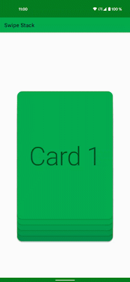

# Recycler Swipe Stack

**An easy to use helper for RecyclerViews. StackLayoutManager and ItemTouchHelperCallback.**

---


| Artifact | Version |
|:-|:-:|
| recycler-swipe-stack | [](https://search.maven.org/artifact/com.kroegerama/recycler-swipe-stack) |

```kotlin
implementation("com.kroegerama:recycler-swipe-stack:$VERSION")
```

---

### Preview



### Usage

#### 1. Create your `SwiperConfig`

```kotlin
val config = SwiperConfig(
    showCount = 5,
    swipeDirections = SwipeDirection.LEFT or SwipeDirection.RIGHT or SwipeDirection.UP,
    stackDirection = StackDirection.Down,
    itemTranslate = 0.02f,
    itemRotation = 15f,
    itemScale = .0f
)
```

#### 2. Create a `SwipeListener`

```kotlin
private val listener = object : SwipeListener {
    override fun onSwipe(
        viewHolder: RecyclerView.ViewHolder,
        dX: Float,
        dY: Float,
        direction: Int
    ) {
    }

    override fun onSwiped(viewHolder: RecyclerView.ViewHolder, direction: Int) {
        Timber.d("onSwiped($direction)")
        //example: remove item from Adapter (and call notifyItemRemoved,
        //if your adapter doesn't do it automatically)
        itemAdapter.removeAt(viewHolder.bindingAdapterPosition)
    }

    override fun onSwipeEnd(viewHolder: RecyclerView.ViewHolder) {
        Timber.d("onSwipeEnd()")
    }

    override fun isSwipeAllowed(viewHolder: RecyclerView.ViewHolder) = viewHolder is MyViewHolder
}
```

#### 3. Setup the library

##### 3a Use the helper function

```kotlin
recycler.setupStack(
    config,
    listener
) {
    itemAnimator = DefaultItemAnimator().apply {
        addDuration = 200
        removeDuration = 200
    }
    adapter = myAdapter
}
```

##### 3b Or setup the classes yourself

###### Create an `ItemTouchHelper` and a `StackLayoutManager`

```kotlin
val itemTouchHelper = ItemTouchHelper(StackSwipeTouchHelperCallback(listener, config))
val layoutManager = StackLayoutManager(config)
```

###### Setup your `RecyclerView`

```kotlin
recycler.layoutManager = layoutManager
itemTouchHelper.attachToRecyclerView(recycler)
```

